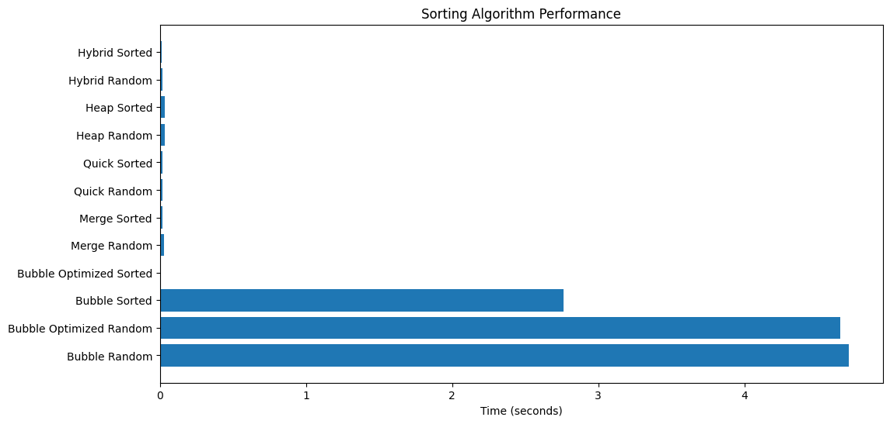
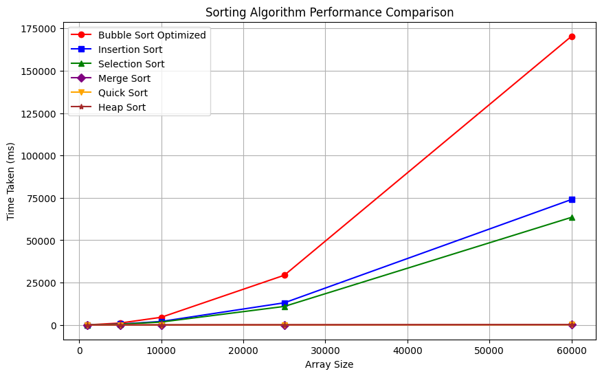
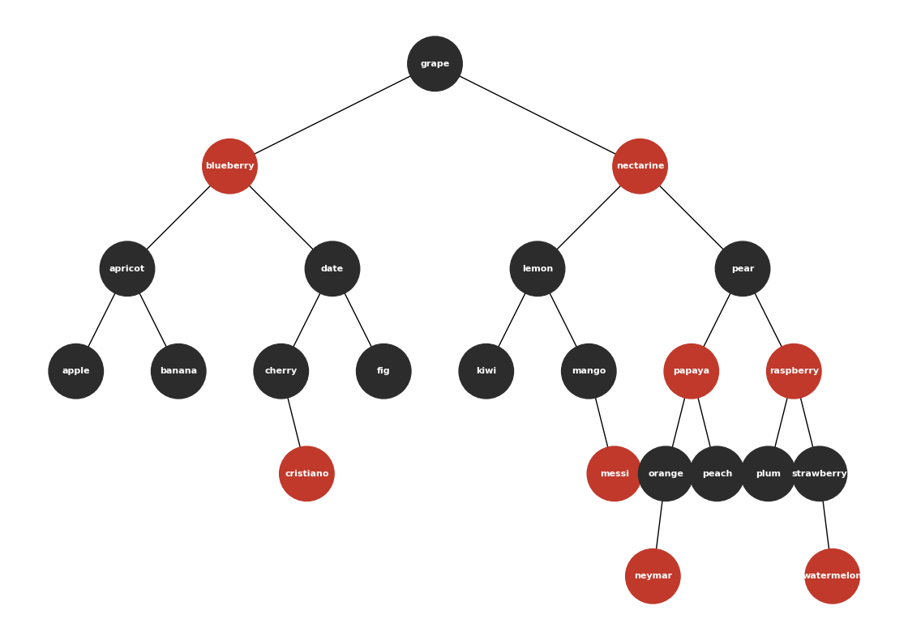
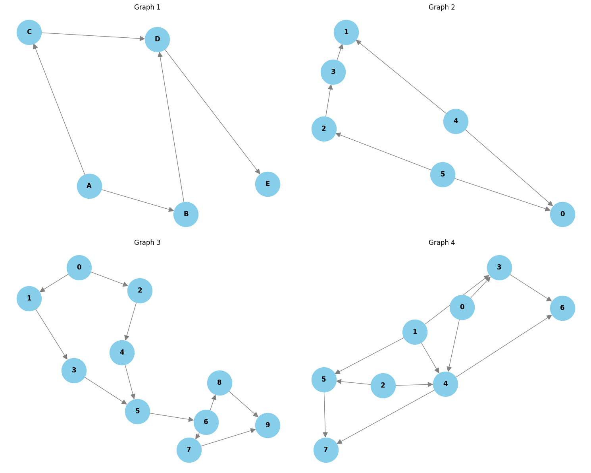

<div align="center">

# Data Structures 2 — Labs

**Sorting Algorithms · Red-Black Trees · Graphs**

A collection of interactive Jupyter Notebooks implementing and visualizing core Data Structures 2 topics: sorting algorithms with performance analysis, a Red-Black Tree–based English dictionary, and graph algorithms (Prim's MST and Topological Sort).

</div>

---

## Table of Contents

- [Repository Structure](#repository-structure)
- [Lab 1 & 2 — Sorting Algorithms](#lab-1--2--sorting-algorithms)
- [Lab 3 — Red-Black Trees & English Dictionary](#lab-3--red-black-trees--english-dictionary)
- [Lab 4 — Graphs](#lab-4--graphs)
- [Getting Started](#getting-started)
- [Dependencies](#dependencies)

---

## Repository Structure

```
.
├── Figures/                                    # Plots & visualizations used in the README
│   ├── output_RBtrees.png
│   ├── output_graphs.png
│   ├── output_sorting1.png
│   └── output_sorting2.png
├── Lab1&2 sorting algorithms/   # Sorting algorithms lab
│   └── sorting_algorithms.ipynb
├── Lab3 redblack trees and english dictionary/
│   ├── RedBlackTrees.ipynb      # RBT implementation + English dictionary
│   └── dictionary.txt           # Word list used by the dictionary
└── Lab4 graphs/
    └── graphs.ipynb             # Prim's MST + Topological Sort with visualization
```

---

## Lab 1 & 2 — Sorting Algorithms

[`sorting_algorithms.ipynb`](Lab1%262%20sorting%20algorithms/sorting_algorithms.ipynb)

This notebook implements and compares several classic sorting algorithms:

| Algorithm | Notes |
|-----------|-------|
| **Quick Sort** | With random pivot selection for balanced partitions |
| **Quick Select** | Finds the *k-th* smallest element in linear expected time |
| **Heap Sort** | In-place sorting using a max-heap |
| **Merge Sort** | Classic divide-and-conquer with `O(n log n)` |
| **Hybrid Merge + Selection** | Fallback to insertion/selection sort for small sub-arrays |
| **Selection Sort** | Simple `O(n²)` in-place sort |
| **Insertion Sort** | Adaptive `O(n²)` sort, fast on nearly-sorted data |
| **Bubble Sort** | Both optimized (early-exit) and unoptimized variants |

> The notebook benchmarks all algorithms on **random** and **sorted** inputs while varying the array size, then visualizes the results.

<p align="center">
  
  
</p>

The benchmark confirms the classic theoretical behavior: quadratic algorithms (`Bubble`, `Insertion`, `Selection`) degrade sharply on large inputs, while `O(n log n)` algorithms (`Merge`, `Quick`, `Heap`) scale gracefully.

---

## Lab 3 — Red-Black Trees & English Dictionary

[`RedBlackTrees.ipynb`](Lab3%20redblack%20trees%20and%20english%20dictionary/RedBlackTrees.ipynb)

### Red-Black Tree

A full implementation of the self-balancing **Red-Black Tree** starting from scratch:

- `Node` with color property (`RED` / `BLACK`)
- `insert()` with color corrections, **rotations** (left/right), and **recoloring**
- `search()` returning the node or `Not Found`
- Tree metatdata: height, black height, size

### English Dictionary

A menu-driven **interactive dictionary** built on top of the Red-Black Tree:

- **Insert** a new word
- **Look-up** a word (instant `O(log n)` retrieval thanks to balancing)
- **Exit**

The word list is loaded from [`dictionary.txt`](Lab3%20redblack%20trees%20and%20english%20dictionary/dictionary.txt), and every new entry keeps the tree balanced, guaranteeing fast look-ups.

<p align="center">
  
</p>

---

## Lab 4 — Graphs

[`graphs.ipynb`](Lab4%20graphs/graphs.ipynb)

### Prim's Minimum Spanning Tree

- Implemented with **Prim's algorithm** using a greedy edge selection strategy
- Prints the MST edges with their weights and the total cost of the tree
- Example output:

```
MST Edges:
a -- b weight: 4
a -- h weight: 8
h -- g weight: 1
g -- f weight: 2
f -- c weight: 4
c -- i weight: 2
c -- d weight: 7
d -- e weight: 9
Total cost: 37
```

### Topological Sort (with Cycle Detection)

- Computes a **topological order** for directed acyclic graphs (DAGs) via in-degree counting (Kahn's algorithm)
- Detects **cycles** and reports them gracefully instead of failing
- Visualizes each graph and its topological order side-by-side using `networkx`

<p align="center">
  
</p>

---

## Getting Started

1. **Clone the repository**

   ```bash
   git clone https://github.com/<your-username>/Data-Structures-2-Labs.git
   cd Data-Structures-2-Labs
   ```

2. **Install dependencies**

   ```bash
   pip install matplotlib numpy networkx
   ```

3. **Run the notebooks**

   ```bash
   jupyter notebook
   ```

   Open any notebook — each one is self-contained with explanations, tests, and visualizations.

---

## Dependencies

| Package | Purpose                             |
|---------|-------------------------------------|
| `Python 3.x` | Language   |
| `Matplotlib` | Plotting & RBT visualization      |
| `networkx` | Graph visualization   |
| `Jupyter Notebook` | Interactive execution |